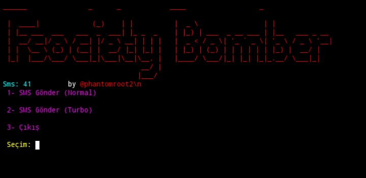
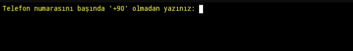

# Fsociety Bomber


Fsociety Bomber ile ilgili herhangi bir eylem ve faaliyet veya etkinlik yalnızca sizin sorumluluğunuzdadır. Bu araç setinin kötüye kullanılması, söz konusu kişilere karşı açılan cezai suçlamalarla sonuçlanabilir. Bu araç setini yasayı çiğnemek için kötüye kullanan herhangi bir kişiye karşı herhangi bir suç duyurusunda bulunulması durumunda katkıda bulunanlar sorumlu tutulmayacaktır.

Bu araç seti, Rahatsız Edicidir Sahte Sms Atmalar İçerir için potansiyel olarak zararlı veya tehlikeli olabilecek malzemeler içerir. Buna yanlış bir şekilde erişmeden, kullanmadan önce veya başka bir şekilde ildeki/ülkenizdeki yasalara bakın.

Bu araç sadece eğitim amaçlı yapılır. Burada bulunan hiçbir şeyle yasayı ihlal etmeye teşebbüs etmeyin. Eğer niyetin buysa, o zaman buradan defol git!

Sadece "fişin nasıl işlediğini" gösterir. Bilgiyi, Sahte Sms Atmak için izinsiz erişim sağlamak için kötüye kullanmayacaksınız. Ancak bunu kendi riskiniz için deneyebilirsiniz.

Özellikler

    Turbo Mod
    Normal Mod


# Fsociety-Bomber


> ⚠️ **UYARI:** Bu araç sadece eğitim amaçlı yapılmıştır! Bu araç setinin kötüye kullanılmasından yazar sorumlu tutulamaz.

---

## 📸 Ekran Görüntüleri

<p align="center">
  
  
</p>

## 🚀 Kurulum Adımları

Aracı kullanmak istediğiniz işletim sistemine uygun adımları takip edin.

### 1. Termux Kurulumu (Android)

Termux üzerinde aracı kurmak için iki farklı yöntem kullanabilirsiniz:

#### Yöntem A: Git ile Manuel Kurulum
```bash
pkg update && pkg upgrade -y
pkg install git bash -y
git clone https://github.com/phantomroot2/Fsociety-Bomber.git
cd Fsociety-Bomber
pip3 install -r requirements.txt
python3 fsocietybomber.py
```

---

### 2. iSH Shell Kurulumu (iOS / iPhone / iPad)

iSH Shell, Alpine Linux tabanlı olduğu için aşağıdaki komutları sırasıyla çalıştırmanız gerekir:

```bash
apk update
apk add git bash curl -y
git clone https://github.com/phantomroot2/Fsociety-Bomber.git
cd Fsociety-Bomber
pip3 install -r requirements.txt
python3 fsocietybomber.py
```

### 3. Kali Linux Kurulumu

Kali Linux üzerinde çalıştırmak için terminalinizi açın ve aşağıdaki komutları sırasıyla uygulayın:

```bash
sudo apt update && sudo apt upgrade -y
sudo apt install git bash -y
git clone https://github.com/phantomroot2/Fsociety-Bomber.git
cd Fsociety-Bomber
pip3 install -r requirements.txt
chmod +x fsocietybomber.py
sudo python3 fsocietybomber.py
```

---

### 4. Windows Kurulumu

Windows üzerinde çalıştırmak için bilgisayarınızda **Git Bash** yüklü olmalıdır.

1. [Git for Windows](https://git-scm.com) indirip kurun.
2. **Git Bash** uygulamasını yönetici olarak açın.
3. Aşağıdaki komutları sırasıyla çalıştırın:

```
git clone https://github.com/phantomroot2/Fsociety-Bomber.git
cd Fsociety-Bomber
pip3 install -r requirements.txt
python3 fsocietybomber.py
```

---
İyi Günler :)
